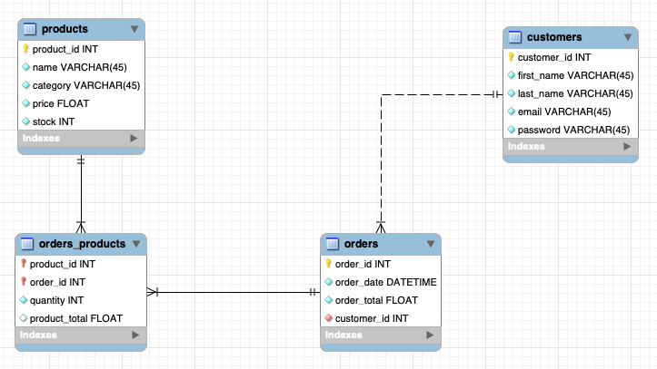

# Mini Project: E-commerce Store with Streamlit + MySQL

## Running this repo
Set up following the steps below is necessary to run the app in this repo:

- Create a new python enviroment and install everything in `requirements.txt`.
- Generate database in MySQL either with: 
  - forward engineering the database in `mini-project-ecommerce-streamlit-mysql.mwb`, or
  - running the queries in `create_model.sql`.
- Generate initial data for the database by running the queries in `generate_data.sql`.
- Create a folder `.streamlit` with a text file `secrets.toml` with the following structure:
````
[mysql]
host = "localhost"
database = "miniproject_ecommerce"
user = "root"
password = "your-password"
````

You're ready to run the app! 
````
streamlit run app.py
````


## Database Structure


## App Structure
- Inside our main function in `app.py` we start with the app title, which appears in all pages through the app. 
- Following the title is the connection to the database, which will be used in multiple functions in our program.
- The app is structured with streamlit session states. In the _session set up_ section we include these structure session states, as well as session states to activate buttons/forms and session variables that are used to store values for logged in users, such as their email address or their cart. There are structure session states for Home Page, Products Page, and Thank You Page. These session states store booleans which can be used inside if statements to allow navigation through the site.
- Many functionalities have been moved into functions in the `functions.py` file to allow for better readability and debugging.

### Home Page
Includes:
- Text prompting the user to log in,
- a sidebar with two buttons that open the sign up and log in forms respectively.
  - The sign up form adds the user-provided details to the customers table in our database.
  - The log in form checks the user-provided details against the data in our customers table and allows the user to move into the Products Page if their email and password are matching with an entry in the database.

### Products Page
- Includes user sidebar by calling `user_sidebar(engine)` function.
- Shows products with the `displayproducts(engine)`, which stores all columns in the products table in the database into a pandas dataframe, shortly cleans the data (adds euro symbol to price column name, and avoids showing any product without stock), and shows the dataframe to the user. This functions returns the resulting dataframe so it can be used in the next function.
- `update_cart(engine, df)` generates two dropdown menus so the user can choose a product and an amount. The following 'Add to cart' button adds the chosen product and its information in the session state `st.session_state.cart`, which is a dictionary storing entries where each key is a product ID and each value is a list including said product's details (in this order: Product Name, Quantity, Product Price, Product Total Price). It also allows the user to add more units of a product already to the cart. 
- `showcart()` prompts the user to add something to the cart when the session state cart is empty, and otherwise shows what is in the cart, using `st.divider()` to separate each product, and displays in the end the total cart price calculated with the `calc_cart_total()` function.
- The `buy(engine)` function includes a button at the end of the cart section. When cliked, this button performs different actions:
  - Adds the order to the orders table in the database.
  - Gets the previously generated order ID from the database.
  - For each product in the cart:
    - adds a new row to the junction table orders_products in the database,
    - and updates the product stock in the products table.
  - Empties the cart session state.
  - Moves the user to the Thank You Page.

### Thank You Page
- Includes user sidebar by calling `user_sidebar(engine)` function.
- Uses `thankyou(engine)` function to:
  - Get all relevant data from the order just made by the user and stores it in a pandas dataframe.
  - Displays the data to the user.
- Includes navigation buttons:
  - `backtoproducts(position)`
  - `logout(position)`
### User functionalities
These are functionalities appearing in multiple pages through the page and therefore moved into functions in the `functions.py` file.
- `user_sidebar(engine)` function generates a sidebar in which the user is welcomed by named and informed of which email they've used to log in. It also calls the other user functionalities functions, including:
  - `customer_rank(engine)` function ranks the user based on the amount of money they have spent on the shop compared to all customers. It counts the total amount of users in the customers table, ranks users in the customers table based on total spent, and informs the user of their rank, the total amount of customers, and the total amount they have spent on the site.
  - `showorders(engine, position)` allows the user to see a table with information of all their previous orders.
  - `logout(position)`
